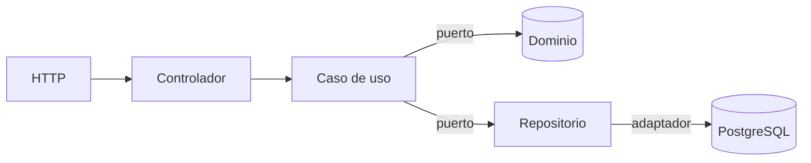

# Nexora ERP

[](https://github.com/Rafarars/nexora-erp/actions/workflows/ci.yml)

Sistema ERP multiempresa construido con arquitectura hexagonal, y su suite de
automatización de pruebas.

### **[→ Ver el reporte de la última ejecución de pruebas](https://rafarars.github.io/nexora-erp/)**

El reporte se publica automáticamente en cada push: escenarios, trazas y capturas
de la suite completa corriendo contra el sistema real.

---

## Qué demuestra este proyecto

El ERP es el sistema bajo prueba. **Lo que se muestra aquí es cómo se automatiza.**

| | |
|---|---|
| **Page Object Model** | Ningún archivo de prueba conoce un selector |
| **Pruebas de API separadas de las de interfaz** | Los contratos HTTP se verifican sin navegador |
| **Pruebas de resiliencia** | Apagan PostgreSQL de verdad y comprueban que el sistema lo detecta |
| **Guarda de rendimiento** | Umbral que rompe la construcción si `/health` se degrada |
| **Guarda de entorno** | Las pruebas destructivas se niegan a correr fuera de un entorno desechable |
| **Escaneo de secretos** | Todo el historial revisado en cada ejecución |
| **Configuración validada** | La aplicación no arranca con variables ausentes o mal formadas |

## Pirámide de pruebas

```
                    ┌─────────────────────────┐
                    │   3  resiliencia        │  apagan la base de datos
                    ├─────────────────────────┤
                    │   4  interfaz (POM)     │  navegador real
                    ├─────────────────────────┤
                    │   3  API (contratos)    │  sin navegador
                    ├─────────────────────────┤
                    │   9  unitarias          │  sin base de datos, 7 ms
                    └─────────────────────────┘
```

Las 9 unitarias corren **sin base de datos, sin Docker y sin framework**, en
milisegundos. Eso no es una optimización: es la demostración de que la arquitectura
hexagonal está bien hecha. Si necesitaran infraestructura, sería decorativa.

## Arquitectura

El dominio no conoce el framework, ni la base de datos, ni HTTP.



```
apps/api/src/contexts/<contexto>/
├── domain/           entidades, value objects, PUERTOS, excepciones
├── application/      casos de uso
└── infrastructure/   controladores, ADAPTADORES, modulo de Nest
```

**Regla dura:** la palabra `prisma` solo puede aparecer en `infrastructure/`. Si
llega al dominio, la hexagonal es de mentira.

## Decisiones y sus alternativas descartadas

| Decisión | Alternativa descartada | Por qué |
|---|---|---|
| **Prisma** | TypeORM | TypeORM pide decoradores sobre las clases, y eso tienta a usar la entidad de base de datos como entidad de dominio. Prisma ni siquiera ofrece esa opción |
| **Puertos con token explícito** | Resolución por tipo | Las interfaces de TypeScript se borran al compilar: el contenedor no puede resolverlas. El token es el equivalente del nombre de servicio de Symfony |
| **Sin módulos globales** | `@Global()` | Con módulos globales no se sabe de dónde vienen las dependencias al leer un archivo. Cada módulo declara lo que necesita |
| **Frontend consume la API desde el servidor** | Peticiones desde el navegador | Sin CORS, sin publicar la dirección de la API, y el futuro token de sesión nunca toca el cliente |
| **Resiliencia en un proyecto aparte** | Todo junto | Apagan la base de datos: en paralelo con las demás las harían fallar sin que nada estuviera roto. Es el origen clásico de las pruebas intermitentes |
| **Fallar al arrancar ante mala configuración** | Valores por defecto en producción | Un `API_URL` ausente que cae en `localhost` no falla: degrada en silencio y nadie se entera |

## Levantar el sistema

```bash
make install   # dependencias
make up        # db + api + web
```

| Servicio | Dirección |
|---|---|
| Frontend | http://localhost:3000 |
| API | http://localhost:3001 |
| Estado del sistema | http://localhost:3001/health |

Los puertos se publican solo en `127.0.0.1`. Ver [`docs/ENVIRONMENT.md`](docs/ENVIRONMENT.md)
para exponerlos deliberadamente en un servidor.

## Comandos

```bash
make help           # lista todo
make test-unit      # dominio, sin base de datos
make test-e2e       # Playwright: API, interfaz y resiliencia
make verify         # todo lo que corre el CI
make verify-clean   # igual, simulando un clon recien clonado
make report         # abre el ultimo reporte
```

`make verify` antes de cada push. `make verify-clean` al tocar Dockerfiles,
dependencias o configuración de compilación: borra todo el código generado y
reconstruye las imágenes sin caché.

## Integración continua

Cada push ejecuta cuatro trabajos en paralelo:

| Trabajo | Qué hace |
|---|---|
| **Secret scan** | `gitleaks` sobre todo el historial |
| **Lint, types and unit tests** | Linter, verificación de tipos y las 9 unitarias |
| **End-to-end tests** | Levanta el sistema con el **mismo `docker compose`** que en local y corre las 10 pruebas |
| **Publish report** | Publica el reporte, y solo si existe |

El pipeline **no tiene ni un secreto configurado**: no pide permisos que no usa.

## Stack

| Capa | Tecnología |
|---|---|
| Backend | NestJS 12 · TypeScript · ESM |
| Frontend | Next.js 16 · React 19 · Tailwind 4 |
| Base de datos | PostgreSQL 17 · Prisma 7 |
| Pruebas | Vitest · Playwright 1.63 |
| Entorno | Docker Compose · pnpm workspaces |

## Estado

| Hito | Estado |
|---|---|
| **H0** Fundación: monorepo, Docker, CI, despliegue de reportes | **Completado** |
| **H1** Multiempresa y acceso: inquilinos, usuarios, roles y permisos | En curso |
| H2–H7 Catálogo, inventario, compras, ventas, cobranza, reportes | Planificado |

Plan completo en [`docs/PLAN.md`](docs/PLAN.md) · Configuración en [`docs/ENVIRONMENT.md`](docs/ENVIRONMENT.md)
